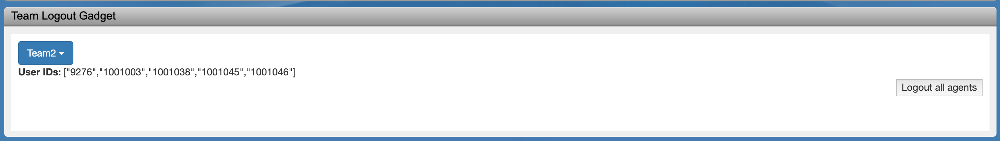

# TeamLogout Gadget
There is missing functionality in CCX/CCE to logout all agents of a team by their supervisor.

This project provides sample code for a Finesse gadget that provides this functionality for CCX and standalone Finesse.

This gadget and code is to be used with Cisco Finesse, a next-generation agent desktop.

The URL used is: 3rdpartygadget/files/TeamLogout/TeamLogout.xml

TeamLogout.xml is the gadget XML file
Note:
This gadget is meant to be used by Supervisors only and it will not work for Agents.

## Additional Info

#### Finesse REST API
Documentation for the Finesse REST API can be found in the [Finesse Developer Guide](https://developer.cisco.com/docs/finesse/#!rest-api-dev-guide).

##### Finesse JavaScript Library
Documentation for the Finesse JavaScript library can be found on [DevNet](https://developer.cisco.com/docs/finesse/#!javascript-library).
